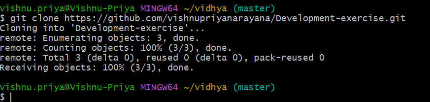
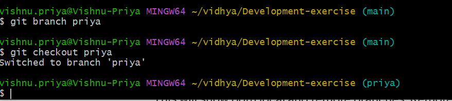
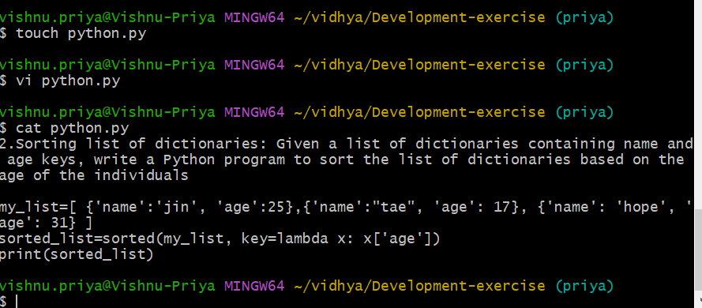
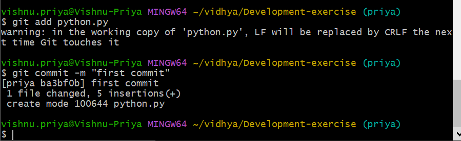
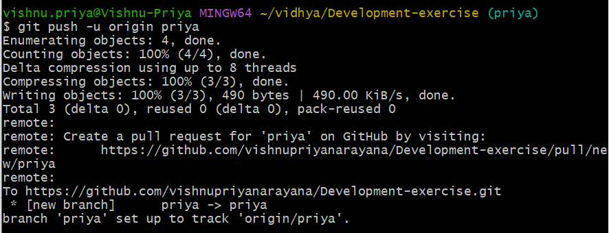
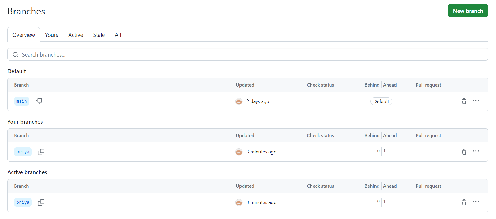
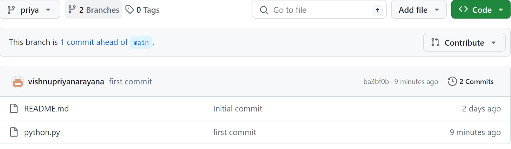
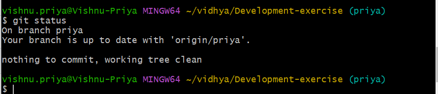
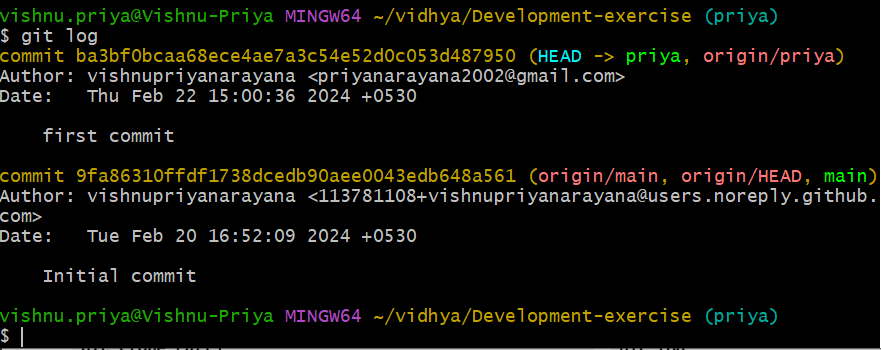
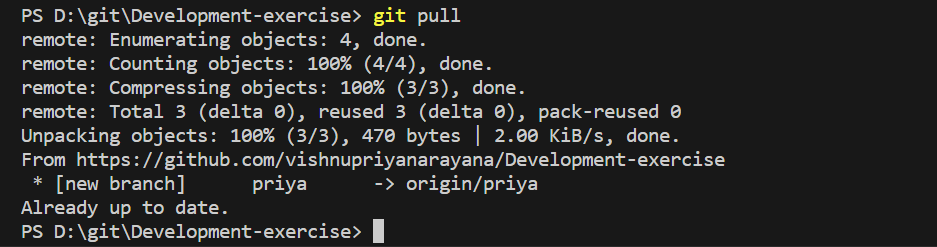

# Development-exercise
1.git clone

2.git branch

3.creating file, add content in file, see the content in file
touch filename, vi filename, cat filename

4.git add, git commit

5.git push -u origin <branch name>

6. git status

7. git log

8.git pull

